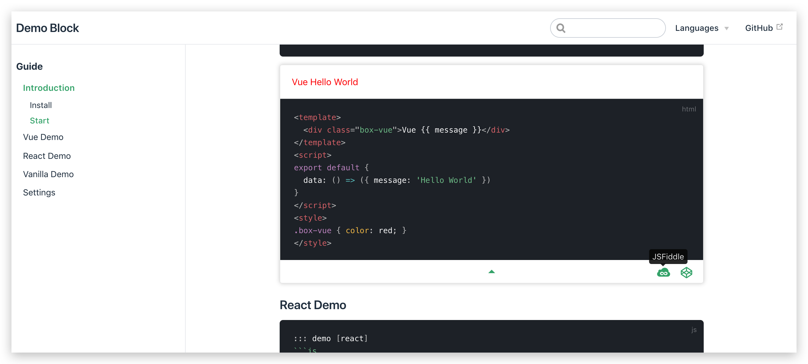

# vuepress-plugin-demo-block


[](https://www.npmjs.com/package/vuepress-plugin-demo-block)


[](https://circleci.com/gh/lq782655835/vuepress-plugin-demo-block)

## Introduction

The Demo Block is used to help you add vue, react or native js examples when writing a document. When writing component documentation, you usually need to add some related examples to the document. These examples can usually be implemented using JSFiddle or Codepen's Iframe, but the maintenance cost will be relatively high. You can quickly add examples by using Demo Block, and it is very convenient to modify.

> To show how to write the example, the three points used to mark the end of the code section are separated by spaces, and the spaces need to be removed when used.



## Feature

- Elegant display code and examples
- Support vue, react and native js
- Support codepen and jsfiddle online demo

## Install

### install vuepress

Reference official document [Vuepress](https://vuepress.vuejs.org)

### install plugin

```
npm i vuepress-plugin-leo-demo-block --save-dev
```

### set vuepress config

config.js
```js
module.exports = {
  plugins: ['demo-block']
}
```

## Start

Write the following code in the Markdown file:

### Vue Demo

```html
::: demo
```html
<template>
  <div class="box-vue">Vue {{ message }}</div>
</template>
<script>
export default {
  data: () => ({ message: 'Hello World' })
}
</script>
<style>
.box-vue { color: red; }
</style>
```
:::
```

### Fixed

* [feat: support ignore script tag](https://github.com/xiguaxigua/vuepress-plugin-demo-block/pull/23)
* fix: auto import vue from vuepress
